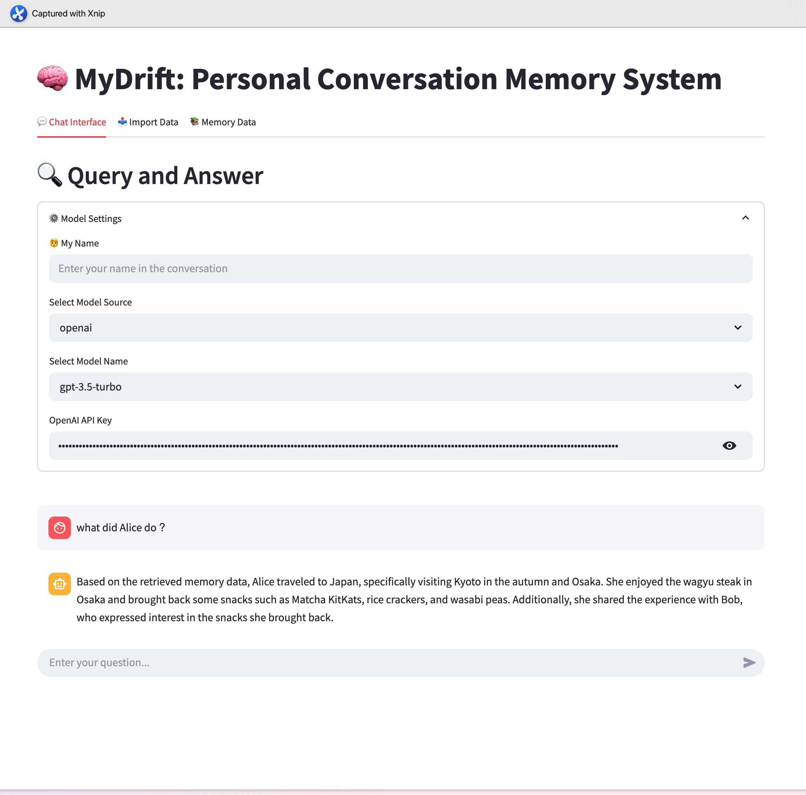

# 🧠 MyDrift


**MyDrift** is a conversation-centric personal memory system that combines a **Streamlit** frontend with a **FastAPI** backend, enabling you to import conversation records and perform natural language queries with ease.

---

## Example
### Input (JSON)
```json
{
    "participants": [
      { "name": "Alice" },
      { "name": "Bob" }
    ],
    "messages": [
      {
        "sender_name": "Bob",
        "timestamp_ms": 1741300000000,
        "content": "Hey! Welcome back! How was Japan?",
        "is_geoblocked_for_viewer": false,
        "is_unsent_image_by_messenger_kid_parent": false
      },
      {
        "sender_name": "Alice",
        "timestamp_ms": 1741300060000,
        "content": "Thanks! It was amazing. Kyoto in the autumn is just magical 🍁",
        "is_geoblocked_for_viewer": false,
        "is_unsent_image_by_messenger_kid_parent": false
      },
      {
        "sender_name": "Bob",
        "timestamp_ms": 1741300120000,
        "content": "I’m so jealous! Did you try the wagyu?",
        "is_geoblocked_for_viewer": false,
        "is_unsent_image_by_messenger_kid_parent": false
      },
      {
        "sender_name": "Alice",
        "timestamp_ms": 1741300180000,
        "content": "Of course! I had the best steak of my life in Osaka 😍",
        "is_geoblocked_for_viewer": false,
        "is_unsent_image_by_messenger_kid_parent": false
      },
      {
        "sender_name": "Bob",
        "timestamp_ms": 1741300240000,
        "content": "Wow, now I’m hungry lol",
        "is_geoblocked_for_viewer": false,
        "is_unsent_image_by_messenger_kid_parent": false
      },
      {
        "sender_name": "Alice",
        "timestamp_ms": 1741300300000,
        "content": "Haha sorry! I brought back some snacks, want some?",
        "is_geoblocked_for_viewer": false,
        "is_unsent_image_by_messenger_kid_parent": false
      },
      {
        "sender_name": "Bob",
        "timestamp_ms": 1741300360000,
        "content": "Yes please 🙏 What did you get?",
        "is_geoblocked_for_viewer": false,
        "is_unsent_image_by_messenger_kid_parent": false
      },
      {
        "sender_name": "Alice",
        "timestamp_ms": 1741300420000,
        "content": "Matcha KitKats, some rice crackers, and weirdly spicy wasabi peas 😂",
        "is_geoblocked_for_viewer": false,
        "is_unsent_image_by_messenger_kid_parent": false
      },
      {
        "sender_name": "Bob",
        "timestamp_ms": 1741300480000,
        "content": "Nice! I’ll swing by your desk later. Also, be ready for 100 emails 😅",
        "is_geoblocked_for_viewer": false,
        "is_unsent_image_by_messenger_kid_parent": false
      },
      {
        "sender_name": "Alice",
        "timestamp_ms": 1741300540000,
        "content": "Already bracing myself lol. Back to reality!",
        "is_geoblocked_for_viewer": false,
        "is_unsent_image_by_messenger_kid_parent": false
      }
    ],
    "title": "Back from Japan",
    "is_still_participant": true,
    "thread_path": "inbox/back_from_japan_bob_alice",
    "magic_words": [],
    "image": {
      "uri": "",
      "creation_timestamp": 0
    },
    "joinable_mode": {
      "mode": 1,
      "link": ""
    }
  }
  
```

### Result


## ✅ Prerequisites

- [Ollama](https://ollama.com/)
- [Docker](https://www.docker.com/)

---

## 🚀 Getting Started

### 1. (Optional) Install Pre-commit Hooks

Install code formatting and linting tools:

```bash
pre-commit install
```

### 2. Build Docker Images

```bash
make build
```

### 3. Start All Services

```bash
make up
```

This launches:
- 🚀 **FastAPI** backend – chat query & data upload APIs
- 💻 **Streamlit** frontend – chat interface, data viewer, and import tool
- 📦 **Qdrant** – vector indexing and search

---

## 🧩 Features Overview

### 💬 Chat Interface

- Ask questions using natural language
- Streamed response display
- Basic chat history support

### 📤 Data Import

- Upload multiple Messenger JSON files
- Backend indexing with real-time progress

### 📚 Memory Data Viewer

- Paginated browsing of conversation chunks
- View start/end timestamps, senders, and full text

---

## 📂 JSON Format Requirements

Each uploaded JSON file should follow this structure (example from [Facebook Messenger Export](https://www.facebook.com/help/messenger-app/713635396288741)):

```json
{
  "start_timestamp": 1690000000000,
  "end_timestamp": 1690000123456,
  "senders": ["Alice", "Bob"],
  "text": "This is the content of a conversation."
}
```

---

## 📎 Common Commands

| Command      | Description                        |
|--------------|------------------------------------|
| `make build` | Build all Docker images            |
| `make up`    | Start all the services via Docker    |

---
